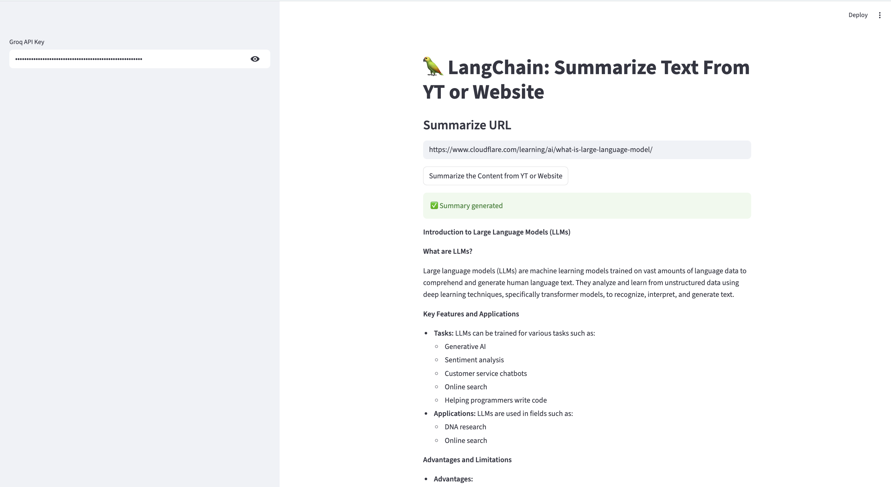

# 🦜 LangChain YouTube & Website Summarizer (Groq + Streamlit)

An AI-powered Streamlit application that summarizes **YouTube videos** and **web articles** using **LangChain** and **Groq LLMs**.
The app automatically extracts content, chunks large text using a **map-reduce summarization pipeline**, and generates concise, structured summaries.

> 🚀 Designed for long videos, research articles, blogs, and documentation.

---

## ✨ Features

* ✅ Summarize **YouTube videos** using transcript extraction
* ✅ Summarize **any public website URL**
* ✅ Handles long content using **Map-Reduce summarization**
* ✅ Powered by **Groq ultra-fast inference**
* ✅ Clean **Streamlit UI**
* ✅ Secure API key input
* ✅ Supports multiple YouTube URL formats:

  * `youtube.com/watch?v=...`
  * `youtu.be/...`
  * `youtube.com/shorts/...`

---

## 🧰 Tech Stack

* **Python 3.9+**
* **Streamlit** – Web UI
* **LangChain + LangChain Classic** – Summarization chains
* **Groq LLMs** – Fast inference
* **youtube-transcript-api** – Transcript extraction
* **Unstructured** – Website parsing
* **Validators** – URL validation

---

## 📦 Installation

### 1️⃣ Clone the Repository

```bash
git clone https://github.com/your-username/youtube-website-summarizer.git
cd youtube-website-summarizer
```

---

### 2️⃣ Create Virtual Environment

```bash
python -m venv venv
source venv/bin/activate        # macOS / Linux
venv\Scripts\activate           # Windows
```

---

### 3️⃣ Install Dependencies

```bash
pip install -r requirements.txt
```

---

### 4️⃣ Run the Application

```bash
python -m streamlit run app.py
```

Open browser at:

```
http://localhost:8501
```

---

## 🔑 Groq API Key Setup

1. Create a free API key from:
   👉 [https://console.groq.com](https://console.groq.com)

---

## ▶️ How to Use

1. Enter your **Groq API Key**.
2. Paste a **YouTube video URL** or **Website URL**.
3. Click **Summarize**.
4. View the generated summary instantly.

---

## 🔢 Token Limits & Performance

### Model Used

```
llama-3.1-8b-instant (Groq)
```

### Approximate Limits

| Parameter              | Value                   |
| ---------------------- | ----------------------- |
| Max context window     | ~128,000 tokens         |
| Recommended safe input | ~80,000 tokens          |
| Output summary         | 200–1,000 words         |
| Token ≈ characters     | ~1 token ≈ 4 characters |

---

### How Large Content Is Handled

The app uses **Map-Reduce Summarization**:

1. Large text is split into chunks
2. Each chunk is summarized independently
3. Partial summaries are merged into a final summary
4. Prevents token overflow errors

This allows safe summarization of:

* 📺 Long YouTube videos (hours)
* 📄 Large web pages and articles

---

## ⚠️ Known Limitations

* ❌ Videos without captions cannot be summarized (unless Whisper transcription is added)
* ❌ Some websites block scraping
* ❌ Very large transcripts (>300k characters) may slow down processing
* ❌ Free Groq API may have rate limits

---

## 📸 Screenshots
Add screenshots inside a `/screenshots` folder and reference here:





---


